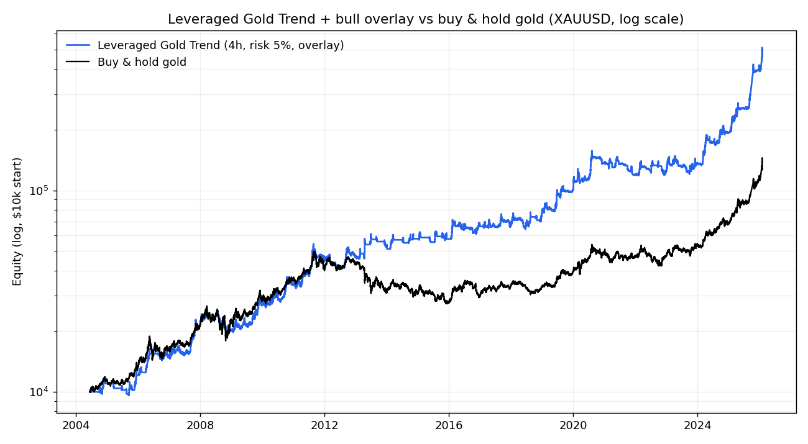
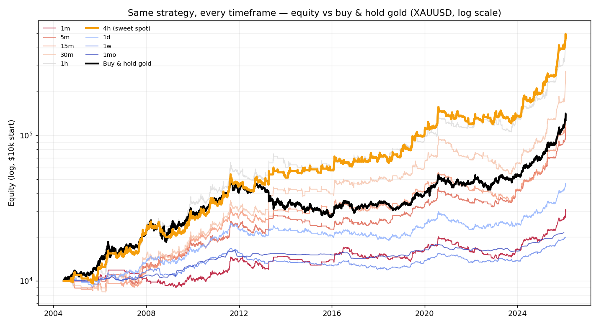
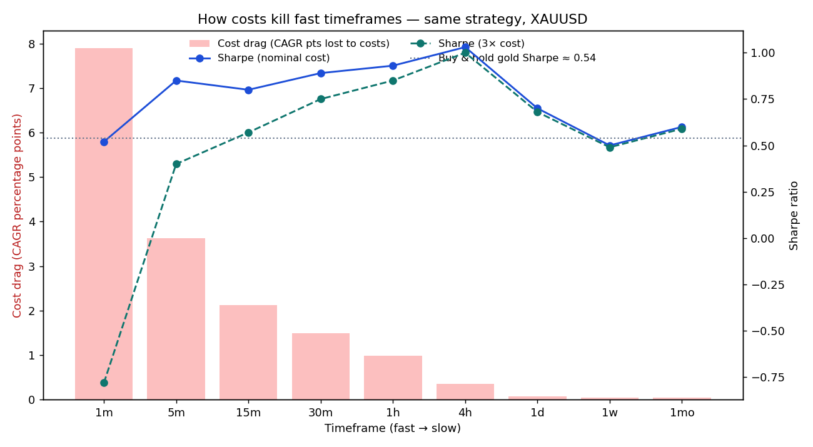
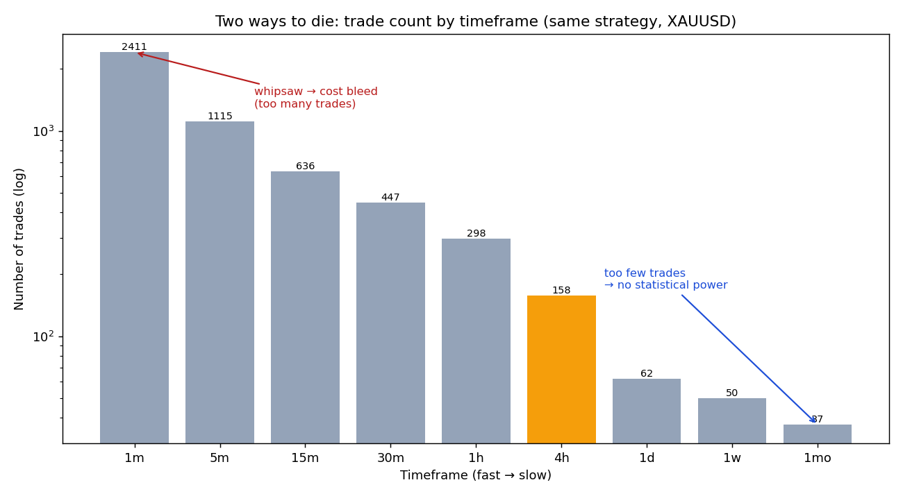
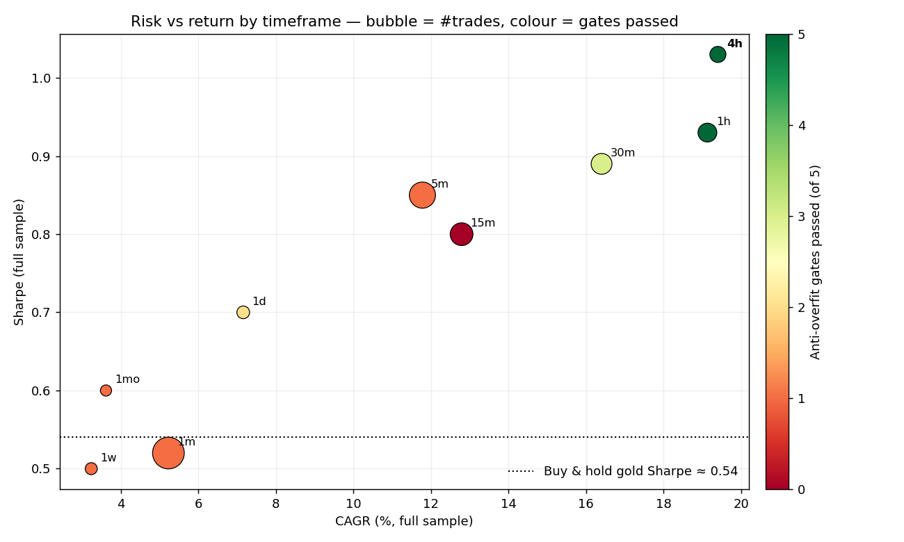
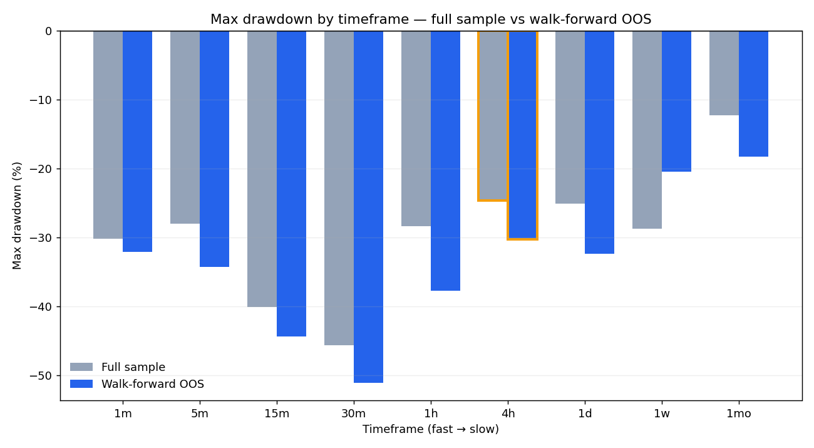
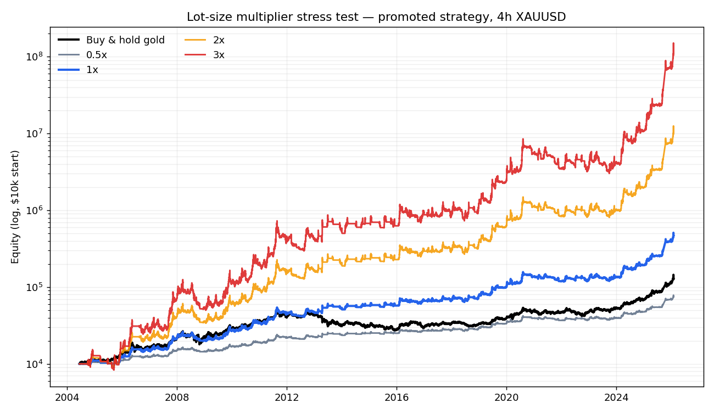
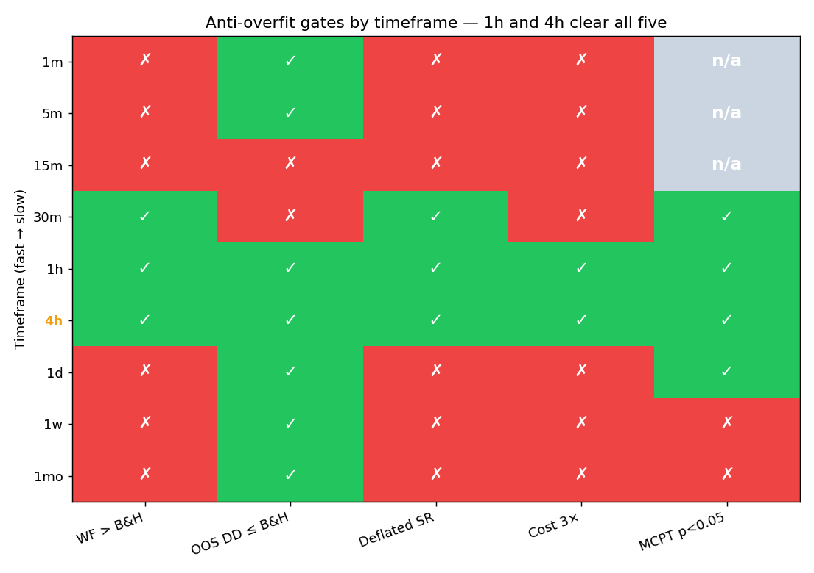

# Leveraged Gold Trend

A governed-leverage trend strategy on **gold (XAUUSD)**, with a small volatility-scaled bull overlay
for flat regimes — and a study of a question every systematic trader runs into: *if I take the
**same** strategy and the **same** asset and only change the **timeframe**, what happens?* The short
answer, with evidence across nine timeframes from 1-minute to monthly: **fast timeframes are damaged
by trading costs, slow ones by having too few trades, and the useful zone is narrow.** For this
strategy on gold, the headline sweet spot is **4-hour bars**; 1-hour also clears the robustness gates,
but with more cost, more drawdown, and weaker out-of-sample Sharpe.

> ⚠️ **Not financial advice. Educational/research only.** This is a backtest. Leverage can wipe out
> your account (and more). Past simulated performance does not predict the future. See
> [Limitations & risks](#limitations--risks) and [LICENSE](LICENSE).

---

## TL;DR — the headline (4h)

Same rules, 4-hour gold bars, 2004–2026, realistic costs:

| Metric | Strategy (4h) | Buy & hold gold |
|---|---|---|
| CAGR | **19.4%** | 12.5% |
| Sharpe | **1.03** | 0.76 |
| Sortino | 1.18 | — |
| Calmar | **0.79** | 0.28 |
| Max drawdown | **−25%** | −45% |
| Avg leverage | 1.15× (cap 3×) | 1× |
| Time in market | 75% | 100% |
| Entries / overlay activations (21 yrs) | 158 | — |

It beats simply holding gold on **return, risk-adjusted return, and drawdown** — and it does so
while still using governed leverage rather than a naked leverage dial. The core trend engine is long
and short; the promoted default adds a small long overlay only while that engine is flat and gold is
above its long-term trend filter.



It passed a full anti-overfitting battery (walk-forward, deflated Sharpe, cost-stress, permutation
test — see [Methodology](#methodology--why-we-believe-it)). **1h also passes; 4h remains the headline
because it has the better full-sample Sharpe, lower drawdown, lower cost drag, and stronger
walk-forward Sharpe.**

---

## Why gold?

Gold (the XAUUSD spot pair, i.e. the price of one ounce in US dollars) is an unusually good asset
for a trend strategy like this:

- **It's a commodity with persistent macro trends.** Gold is a monetary/safe-haven and
  inflation-hedge asset. Its price is driven by real interest rates, the dollar, and risk sentiment
  — slow-moving macro forces that produce **long, sustained trends** (2004–2011 up, 2011–2015 down,
  2019–2026 up) interspersed with multi-year ranges. Trend-following lives on exactly that.
- **It's deeply liquid and trades ~24 hours a day.** XAUUSD is one of the most heavily traded
  instruments in the world, with **tight spreads** at major brokers and continuous ~24×5 trading.
  Tight cost + deep liquidity is what makes a leveraged, stop-based system *plausible* (and it's why
  this exact study would look very different on an illiquid asset).
- **It's decorrelated from equities.** Gold often rises when stocks fall, so a gold strategy is a
  useful diversifier rather than one more bet on the S&P 500.
- **Leverage is cheap and native.** Via spot CFDs, spread bets, or futures (GC / micro MGC), you can
  run gold at 2–3× notional without huge capital — which is precisely why retail traders are drawn
  to it, and precisely why disciplined position sizing matters so much (see below).

These properties — trends + liquidity + cheap leverage — are why gold is such a popular vehicle for
exactly this kind of leveraged trend trade, and why we use it as the laboratory for the timeframe
question.

---

## How the strategy works

Five ideas, kept deliberately simple enough to audit.

### 1. Entry — Donchian breakout (ride the trend)

At each bar's close, enter in the direction of a breakout of the recent range:

- **Go long** when the close makes a new **55-day** high.
- **Go short** when the close makes a new **100-day** low.

Breakouts are the classic, robust trend entry: you only get long after strength has been confirmed,
and you're flat in the chop.

### 2. Exit — ATR "Chandelier" trailing stop (let winners run)

There is **no take-profit**. Instead the position is closed by a trailing stop that ratchets toward
price as the trade moves your way:

- For a long: `stop = (highest close since entry) − k × ATR`, with **k = 5** and a 20-day ATR.
  Exit when price closes below the stop (or below the 20-day low). Symmetric for shorts.

Why no profit target? Trend-following makes its money from a **few very large winners** that pay for
many small losses. A take-profit caps exactly that right tail — it feels good and lowers your win
rate's volatility, but it quietly removes the source of the edge. So we let winners run and only cut
losers. (This is the Clenow / Carver school of trend design.)

### 3. Position sizing — risk-per-trade → *governed, emergent* leverage

This is the heart of the strategy, and the part most retail traders get backwards. **Leverage is not
a "make me more money" dial.** Over-betting a positive-expectation system mathematically drives it
toward ruin (Ralph Vince's leverage-space work; the Kelly literature). So leverage here is an
*output of a risk decision*, not an input:

> Size each trade so that **if the trailing stop is hit, you lose a fixed fraction `r` of equity**.

With a stop `stop_frac` away from entry (as a fraction of price), the position notional that risks
exactly `r` of equity is:

```
notional_fraction = r / stop_frac        # e.g. r = 5%
leverage = min(notional_fraction, CAP)   # hard ceiling, CAP = 3×
```

So a **tight** stop (calm market, low ATR) earns a **larger** position, a **wide** stop earns a
smaller one — and the gross exposure is **never** allowed above a hard cap (3×). Leverage *emerges*
from volatility and is *governed* by the cap. On the promoted 4h default the average gross exposure
is ≈1.15× because the small overlay spends more time active than the high-conviction breakout engine;
the cap still binds on the strongest core trend trades.

**The leverage is not free.** Sweeping `r` from 1% → 20% reproduces Vince's growth-then-ruin curve
exactly: CAGR rises until ≈5%, then **Sharpe and Calmar fall while drawdown explodes**. The
risk-adjusted optimum is a *modest* 2–5% per trade, not the cap. We ship `r = 5%` as the "grow faster
but still beat buy-&-hold on every headline axis" setting; reduce it if the drawdown profile is too
aggressive.

### 4. Re-risking — keep winners sized, but with inertia

When an open trade makes a new favourable close, the strategy can recompute the distance to the
ratcheted stop and rebalance back toward the intended risk. A 10% inertia band suppresses tiny
adjustments, so this is not continuous churn: it is a controlled way to keep large winners from
becoming under-sized after the stop moves.

### 5. Bull overlay — participate when the core engine is flat

Pure breakout systems often miss long stretches of a secular bull market while waiting for a fresh
high after a pullback. The promoted default adds up to **0.5× long** exposure while the core state
machine is flat and gold is above a **300-day EMA**. That overlay is scaled by a volatility-regime
multiplier: larger in relatively calm regimes, smaller when volatility is high. It is deliberately
small, long-only, and disabled whenever the main Donchian/ATR engine has a position.

---

## How to actually follow it

A concrete recipe (this is description, not advice):

- **Instrument:** XAUUSD spot (CFD/spread bet) at a tight-spread broker, or gold futures (GC / micro
  MGC). Pick the cheapest, most liquid one you can access.
- **Timeframe:** 4-hour bars. Gold trades ~24h, so that's ~6 bars/day; you make a decision only at
  each 4h close (~6 checks/day — not a screen-watching system).
- **Each 4h close, do this:**
  1. Update the 55-day high, 100-day low, the 20/50-day exit channels, and the 20-day ATR (in 4h
     bars: 55 days ≈ 330 bars, 20 days ≈ 120 bars), plus the 300-day EMA for the overlay.
  2. **If flat:** new 55-day-high close → go long; new 100-day-low close → go short. If neither
     breakout fires but gold is above its 300-day EMA, hold the small volatility-scaled long overlay.
  3. **Size it:** stop distance = 5 × ATR. Risk 5% of equity to that stop →
     `units = 0.05 × equity / (5 × ATR × point_value)`, capped so notional ≤ 3 × equity.
  4. **If in a core position:** trail the stop (highest-close-since-entry − 5×ATR for longs); exit on
     a stop hit or the opposite channel. If the trade keeps making favourable closes, re-risk toward
     the current stop distance, subject to the 10% inertia band. No take-profit.
- **Worked example:** equity \$10,000, gold \$2,000, ATR = \$20 → stop distance \$100 (5% of price).
  Risk \$500 → notional \$500 / 0.05 = \$10,000 = **1.0×**. If the market is calmer (ATR \$10), the
  stop is 2.5% → size doubles to **2.0×**; the 3× cap binds only when ATR gets very small.
- **Watch in live trading:** overnight **swap/financing** (charged daily on leveraged positions —
   *not* modelled here, see below) and **slippage** in thin sessions. Both hurt more the faster you
  trade — and the overlay is active more often than the pure breakout engine, so financing matters.

---

## The timeframe question (the main event)

Here is the same promoted strategy (`r = 5%`, cap 3×, 0.5× EMA300 volatility-scaled overlay), the
same asset, run on **all nine timeframes**.
`cost_drag` = CAGR percentage points lost to costs; `cost3 Sharpe` = Sharpe after **3× nominal
cost**; `WF Sharpe` = walk-forward out-of-sample Sharpe (vs buy-&-hold "B&H"); `MCPT p` = permutation
p-value (blank where skipped for runtime); `gates` = how many of the 5 anti-overfit gates pass.

| TF | bars | entries | CAGR | Sharpe | MaxDD | avg lev | cost_drag | cost3 Sharpe | WF Sharpe (B&H) | DSR | MCPT p | gates |
|---|---:|---:|---:|---:|---:|---:|---:|---:|---|---:|---:|:--|
| 1m | 6.8M | 2411 | 5.2% | 0.52 | −30% | 0.67 | **7.90%** | **−0.78** | 0.17 (0.51) | 0.425 | — | 1/5 |
| 5m | 1.4M | 1115 | 11.8% | 0.85 | −28% | 0.78 | 3.63% | 0.40 | 0.51 (0.53) | 0.941 | — | 1/5 |
| 15m | 494k | 636 | 12.8% | 0.80 | −40% | 0.89 | 2.12% | 0.57 | 0.49 (0.54) | 0.909 | — | 0/5 |
| 30m | 249k | 447 | 16.4% | 0.89 | −46% | 0.99 | 1.49% | 0.75 | 0.64 (0.54) | 0.979 | 0.016 | 3/5 |
| **1h** | **125k** | **298** | **19.1%** | **0.93** | **−28%** | **1.11** | **0.99%** | **0.85** | **0.69 (0.54)** | **0.984** | **0.010** | **5/5 ✅** |
| **4h** | **33k** | **158** | **19.4%** | **1.03** | **−25%** | **1.15** | **0.35%** | **1.00** | **0.82 (0.55)** | **0.999** | **0.007** | **5/5 ✅** |
| 1d | 5.5k | 62 | 7.2% | 0.70 | −25% | 0.70 | 0.08% | 0.68 | 0.35 (0.53) | 0.881 | 0.030 | 2/5 |
| 1w | 1.1k | 50 | 3.2% | 0.50 | −29% | 0.43 | 0.05% | 0.49 | 0.27 (0.54) | 0.723 | 0.209 | 1/5 |
| 1mo | 260 | 37 | 3.6% | 0.60 | −12% | 0.31 | 0.04% | 0.59 | 0.26 (0.52) | 0.653 | 0.109 | 1/5 |

The headline chart, but for **all nine timeframes at once** (each at `r = 5%`, daily-sampled, log
scale). **1h and 4h** both pull above buy-&-hold gold (black); 4h is highlighted because it keeps the
best combination of return, Sharpe, drawdown, cost drag, and walk-forward evidence. One strategy,
nine speeds — almost the entire spread between them is a cost-and-sample-size story, which the rest
of this section unpacks.





### How costs "kill" the fast timeframes

Look at the `cost_drag` column climb as the bars get finer: **0.04% at monthly → 0.35% at 4h →
7.90% at 1-minute**. The 1m version loses almost eight CAGR points to costs, and once you stress
costs to a realistic 3× its Sharpe goes **negative (−0.78)**. Why does turnover (and therefore cost)
explode on fast bars even though the lookbacks are the same number of days? Because the trailing stop
and the volatility-scaled overlay adjust far more often on fine bars (2411 entries/activations at 1m
vs 158 on 4h), and every exposure change pays the spread. Faster ≠ more edge; faster = **more
friction**.



This is the whole study in one chart — **two ways to die.** Entry/activation count *explodes* toward
fast bars (2411 at 1m, much of it trailing-stop whipsaw and overlay adjustment) and *starves* toward
slow ones (37 at monthly). The fast end pays that turnover away in spread; the slow end runs out of
statistical evidence (next subsection). 1h and 4h land where there are enough observations to mean
something, yet few enough that cost is still survivable.

And remember costs here are modelled at a *nominal* tight spread. Real intraday gold spreads in thin
hours are wider, and **overnight financing is not charged at all** — both of which would punish the
fast timeframes even harder. So if anything this *understates* the cost cliff.

### Why the slow timeframes fail too

The other end is more subtle. At weekly/monthly bars cost is negligible (`cost_drag` ≈ 0) — but the
strategy now makes only 37–50 entries/activations in 21 years, and **a handful of events carries
almost no statistical evidence.** Their walk-forward Sharpe stays well below buy-&-hold (1w: 0.27;
1mo: 0.26), their deflated Sharpe falls below the 0.95 bar, and the permutation test can't distinguish
them from luck. They also under-use leverage (avg 0.31–0.43×), because over a long bar the ATR stop is
wide in percentage terms, so the risk-per-trade sizing keeps core positions small. Daily (1d) sits in
a dead zone: too few events to beat buy-&-hold out-of-sample and no longer fast enough to add much
timing value.

### The sweet spot

**1h and 4h clear all five gates; 4h is the headline sweet spot.** The promoted overlay makes 1h a
credible neighbour, but 4h is cleaner: 19.4% CAGR, 1.03 Sharpe, −25% max drawdown, deflated Sharpe
0.999, permutation p = 0.007, 0.35% cost drag, and Sharpe 1.00 even at 3× cost. 1h is viable but
costlier (0.99% drag), lower Sharpe (0.93), lower walk-forward Sharpe (0.69 vs 0.82), and deeper OOS
drawdown (−38% vs −30%). That's the lesson in one sentence: **the right timeframe is the one where
your edge is real *and* your costs are still negligible — and for leveraged gold trend, 4h remains the
best balance.**



Plotting every timeframe by return (x) against risk-adjusted return (y) — bubble size = number of
entries, colour = anti-overfit gates passed — makes the useful zone visually obvious: **1h and 4h are
dark green, with 4h higher on Sharpe and lower on cost.** The huge fast-timeframe bubbles are the cost
cliff in one dot, and the small bubbles hugging the buy-&-hold line are the event-starved slow
timeframes.



Drawdown tells the same story from the risk side: it is worst where the fast bars still churn but the
edge is not clean enough (full-sample −46% at 30m; OOS −51%). 4h's −25% full-sample drawdown is the
mildest of the high-return leveraged timeframes, and its −30% walk-forward drawdown stays comfortably
inside buy-&-hold gold's −41% OOS drawdown.

---

## Lot-size multiplier stress test

The shipped strategy already uses governed leverage: position size comes from risk-to-stop and is
capped at 3×. But it is useful to ask what happens if someone simply multiplies the final exposure by
an external lot-size multiplier. This is **not** the default strategy; it is a leverage stress test on
top of the exact same 4h signals, stops, overlay, re-risking, and costs.



| Lot multiplier | CAGR | Sharpe | MaxDD | Avg leverage | Max leverage |
|---:|---:|---:|---:|---:|---:|
| 0.5× | 9.7% | 1.03 | −13.0% | 0.58× | 1.5× |
| 1.0× | 19.4% | 1.03 | −24.7% | 1.15× | 3.0× |
| 2.0× | 37.8% | 1.03 | −45.8% | 2.31× | 6.0× |
| 3.0× | 53.8% | 1.03 | −64.6% | 3.46× | 9.0× |

The equity curve looks tempting because CAGR scales up dramatically, but the drawdown scales up too:
2× already reaches a buy-&-hold-like drawdown, and 3× turns the strategy into a −65% max-drawdown
profile. Sharpe stays almost unchanged because this test mostly scales the same return stream and the
same turnover costs. That is exactly the point: lot-size multipliers are not new edge; they are a
choice to trade the same edge with more ruin risk.

---

## Methodology — why we believe it

Backtests lie if you let them. Every result above is gated by five standard anti-overfitting tests
(parameters are selected only on training windows, then stitched out-of-sample):

1. **Walk-forward analysis** (Pardo) — pick from a small predeclared family around the promoted
   default (overlay size 0.25–1.0×, EMA 200/300, volatility multiplier on/off, re-risk inertia
   10%/25%) on each in-sample window, apply it to the next out-of-sample window, and stitch the OOS
   pieces. PASS only if OOS Sharpe beats buy-&-hold gold.
2. **Drawdown constraint** — OOS max drawdown must be ≤ buy-&-hold gold's. Drawdown is a hard limit,
   never the thing we maximize.
3. **Deflated Sharpe ratio** (López de Prado) — corrects the observed Sharpe for the number of
   configurations tried and for non-normal returns. PASS if > 0.95.
4. **Cost stress** — re-run at 3× the nominal spread. The edge must survive realistic, even
   pessimistic, costs.
5. **Permutation test / MCPT** (Masters, Aronson) — shuffle the return sequence (destroying trend
   structure), rebuild a synthetic price path, and re-run many times. PASS if the real
   ordering's Sharpe beats the random ones with p < 0.05 — i.e. the edge comes from *trend*, not from
   curve-fitting.



Running all five gates across all nine timeframes makes the verdict sharper than the headline table
alone: **1h and 4h are green on every gate, and 4h is the stronger of the two.** The fast timeframes
(1m–30m) fail cost-stress and/or OOS drawdown; the slow ones (1d–1mo) fail walk-forward and
deflated-Sharpe for lack of events. MCPT is marked *n/a* on the three fastest bars, where the
permutation test is too expensive to run (the other columns already condemn them).

The promoted default came after a staged research path, not after blindly adding knobs. The original
pure Donchian/ATR system already worked on 4h (16.1% CAGR, 0.88 Sharpe, −26% max drawdown, 5/5 gates)
but lagged passive gold in the early bull market. A naked volatility-targeted EWMAC variant blew up
(−64% drawdown), and a simple regime filter added little. The promoted re-risk + 0.5× EMA300 overlay
variant was then validated against the neighbouring family above, including DSR, cost stress, and
permutation testing, before becoming the default.

---

## Limitations & risks

Read these before taking any of the numbers seriously.

- **Overnight financing/swap is not modelled.** The cost model charges spread + commission on
  turnover but not the daily carry on a held leveraged position. For a system that holds trades for
  days/weeks this **understates real cost** — treat the headline as a mild upper bound. (It does not
  change the *timeframe ranking*; if anything it widens the gap against the fast TFs.)
- **One asset, one (favourable) sample.** 2004–2026 is largely a secular gold bull. The core engine is
  long/short, but the promoted overlay deliberately adds long exposure in bull regimes. A single asset
  over a single regime is thin evidence. Don't extrapolate to other assets or regimes without
  re-testing.
- **It's a returns-based simulation, not an order-book backtest.** Fills are modelled at bar
  granularity with a close-based trailing stop and constant-fraction (daily-rebalanced) leverage;
  live execution (gaps, intrabar stop fills, partial fills, slippage spikes) will differ.
- **Drawdown is real.** −25% at `r = 5%` (and some faster variants still hit −40%+). Leverage
  cuts both ways. Size down (`r = 2%`) if that hurts.
- **No look-ahead, by construction** — signals use only completed bars; exposure decided at a bar's
  close earns the *next* bar's return; rolling stats are shifted. But verify it yourself.

---

## Reproduce it

```bash
pip install -e .                              # numpy, pandas, scipy, pyarrow, matplotlib
pip install kaggle                            # only for the data download
python scripts/download_data.py               # fetch XAUUSD -> data/*.parquet (needs a Kaggle token)

python -m leveraged_gold_trend --interval 4h            # headline metrics
python -m leveraged_gold_trend --interval 4h --validate # + the 5 gates
python -m leveraged_gold_trend --scan                   # the 9-timeframe table -> results/
python -m leveraged_gold_trend --plots                  # regenerate the charts
python scripts/multiplier_scan.py --interval 4h         # lot-size multiplier stress test
```

The precomputed evidence is committed under [`results/`](results/) (the 9-timeframe table, the
headline metrics JSON, the multiplier stress test, and the charts), so you can read the whole study
without downloading anything or re-running the heavy 1-minute pass (which can take several minutes).

**Data:** Kaggle `novandraanugrah/xauusd-gold-price-historical-data-2004-2024`. Not redistributed
here (the 1-minute file alone is ~100 MB); `download_data.py` fetches it.

---

## References

The strategy and its validation are grounded in the systematic-trading literature:

- Robert Carver — *Leveraged Trading* (2019) and *Systematic Trading* (2015): risk-target position
  sizing; leverage as the central danger of retail trading; volatility-aware exposure scaling.
- Gary Antonacci — *Dual Momentum Investing* (2014), and Michael Gayed's work on leverage and
  volatility regimes: bull-regime participation with explicit risk control.
- Andreas Clenow — *Following the Trend* (2023) and *Stocks on the Move* (2015): diversified trend
  following; let winners run, exit by stop/rank not profit target.
- Ralph Vince — *The Leverage Space Trading Model* (2009): over-betting drives positive-expectation
  systems to ruin.
- Van K. Tharp — *Trade Your Way to Financial Freedom* (1998): position sizing and expectancy.
- Robert Pardo — *The Evaluation and Optimization of Trading Strategies* (2008): walk-forward analysis.
- Timothy Masters — *Testing and Tuning Market Trading Systems* (2018); David Aronson —
  *Evidence-Based Technical Analysis* (2007): permutation tests and data-mining bias.
- Marcos López de Prado — *Advances in Financial Machine Learning* (2018): the deflated Sharpe ratio.

---

## License

[MIT](LICENSE). **Not financial advice — educational and research use only. Trading leveraged
products carries a high risk of loss.**
